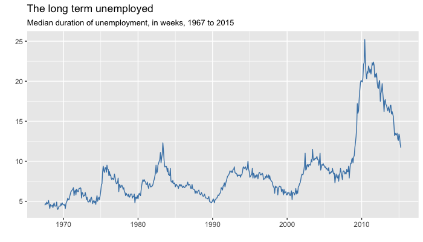

# ggmjs

A ggplot2 theme for the Milwaukee Journal Sentinel

## What's it look like?

#### Before


#### After


See the `examples/` folder for example graphics generated using the theme.

## Install

Install prequisites within the R console.
```
install.packages('devtools')
install.packages('roxygen2')
library(devtools)
library(roxygen2)
```

Pull down this repo from github.
```
git pull https://github.com/datahub/ggmjs.git
```

Install `ggmjs` in the R console.
```
setwd('[parent folder to ggmjs]')
install('ggmjs')
```

## Develop

Follow the instructions from the [Install](#install) section.

Make changes to the code in the `R/` folder. Add documentation to each exported function following [roxygen2](https://github.com/yihui/roxygen2) conventions.

When you're done, compile the documentation. Run this in the R console.
```
setwd('./ggmjs')
document()
```

Reinstall the package following the instructions in the [Install](#install) section and you'll be able to test the library.

See Hilary Parker's blog post on [writing R packages](https://hilaryparker.com/2014/04/29/writing-an-r-package-from-scratch/) for a bit more context.